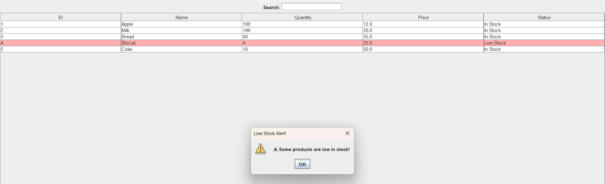
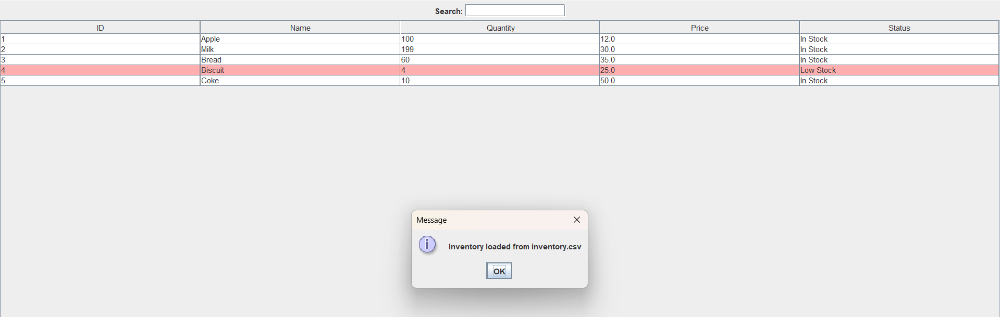

# 🛒 Inventory Management System (Java)


A **Java-based Inventory Management System** with a **graphical user interface (GUI)** built using **Swing**, designed to manage products efficiently.

---

## 🔹 Features
- Add, Update, Delete, and Sell products  
- Live search functionality  
- Status column showing **In Stock / Low Stock / Out of Stock**  
- Low stock rows highlighted in **pink**, out-of-stock in **red**  
- Low stock alert popup when products fall below a threshold  
- **CSV support**:
  - Save current inventory to `inventory.csv`
  - Load inventory from `inventory.csv`  

---

## 📂 Project Structure
Inventory-Management-System/
├── src/
│ ├── Main.java
│ ├── InventoryGUI.java
│ ├── Product.java
│ └── ProductManager.java
├── README.md
├── inventory.csv (created after saving)

yaml
Copy code

---

## 🚀 How to Run
1. Clone the repository:
```bash
git clone https://github.com/username/Inventory-Management-System.git
Navigate to the src folder:

bash
Copy code
cd Inventory-Management-System/src
Compile all Java files:

bash
Copy code
javac *.java
Run the application:

bash
Copy code
java Main
💾 CSV Usage
Save Inventory: Click the Save CSV button to save all products to inventory.csv.

Load Inventory: Click the Load CSV button to load products from inventory.csv.

This allows you to persist inventory data between sessions.

🖼 Screenshots


👩‍💻 Author
Mayuri Maurya | B. Sc.IT (2nd Year)